# Projekt-Architektur und Flussdiagramme

## Ziel
- Einheitliche Architektur- und Ablaufdokumentation fuer Node-RED und Arduino.
- Klare Trennung zwischen Node-RED-Flows und Arduino-Funktionslogik.

## 1) Node-RED Flussdiagramme (durchnummeriert)

### 1.1 Node-RED Gesamtarchitektur
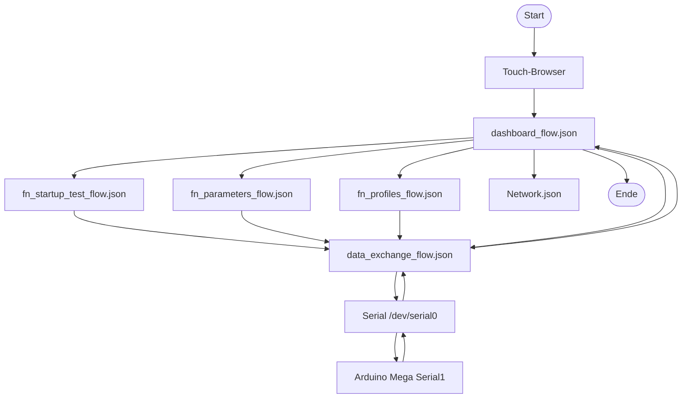
```mermaid
flowchart TD
  S([Start]) --> B["Touch-Browser"]
  B --> D["dashboard_flow.json"]

  D --> F1["fn_startup_test_flow.json"]
  D --> F2["fn_parameters_flow.json"]
  D --> F3["fn_profiles_flow.json"]
  D --> F4["Network.json"]

  F1 --> DX["data_exchange_flow.json"]
  F2 --> DX
  F3 --> DX
  D --> DX

  DX --> U["Serial /dev/serial0"]
  U --> A["Arduino Mega Serial1"]
  A --> U
  U --> DX
  DX --> D
  D --> E([Ende])
```

### 1.2 `data_exchange_flow.json` (Serial-Gateway)
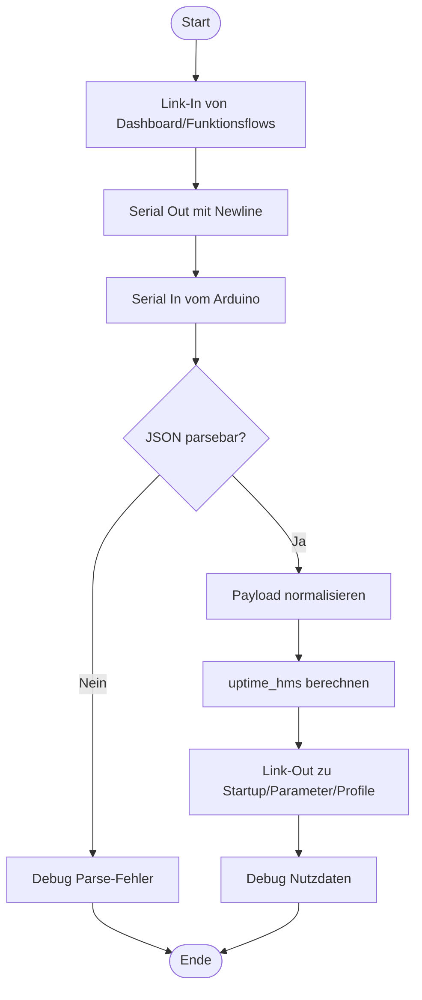
```mermaid
flowchart TD
  S([Start]) --> I["Link-In von Dashboard/Funktionsflows"]
  I --> T["Serial Out mit Newline"]
  T --> R["Serial In vom Arduino"]
  R --> P{"JSON parsebar?"}
  P -- Nein --> G0["Debug Parse-Fehler"]
  G0 --> E([Ende])
  P -- Ja --> M["Payload normalisieren"]
  M --> U["uptime_hms berechnen"]
  U --> O["Link-Out zu Startup/Parameter/Profile"]
  O --> G1["Debug Nutzdaten"]
  G1 --> E
```

### 1.3 `fn_startup_test_flow.json` (Starttest)
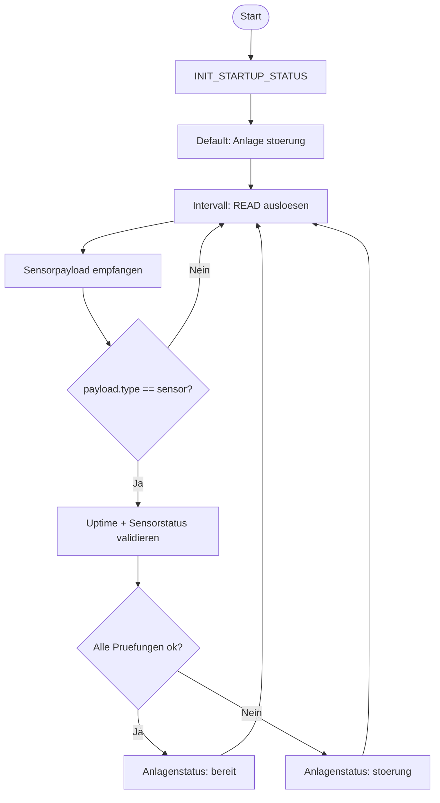
```mermaid
flowchart TD
  S([Start]) --> I0["INIT_STARTUP_STATUS"]
  I0 --> I1["Default: Anlage stoerung"]
  I1 --> C0["Intervall: READ ausloesen"]
  C0 --> D0["Sensorpayload empfangen"]
  D0 --> P{"payload.type == sensor?"}
  P -- Nein --> C0
  P -- Ja --> V["Uptime + Sensorstatus validieren"]
  V --> O{"Alle Pruefungen ok?"}
  O -- Ja --> A0["Anlagenstatus: bereit"]
  O -- Nein --> A1["Anlagenstatus: stoerung"]
  A0 --> C0
  A1 --> C0
```

### 1.4 `fn_parameters_flow.json` (Offsets + Relais)
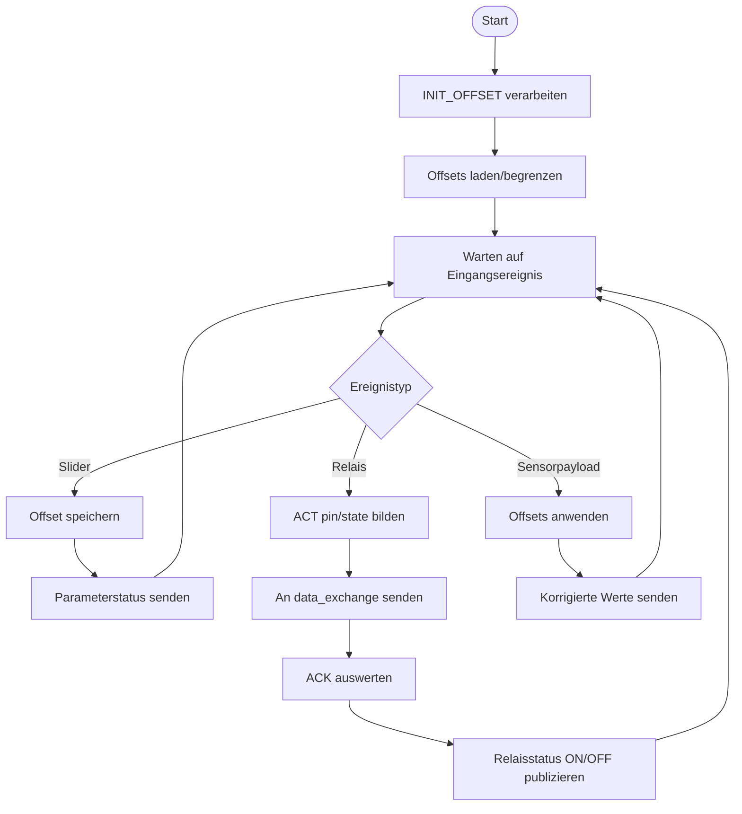
```mermaid
flowchart TD
  S([Start]) --> I0["INIT_OFFSET verarbeiten"]
  I0 --> I1["Offsets laden/begrenzen"]
  I1 --> W["Warten auf Eingangsereignis"]

  W --> T{"Ereignistyp"}
  T -- Slider --> O0["Offset speichern"]
  O0 --> O1["Parameterstatus senden"]
  O1 --> W

  T -- Relais --> R0["ACT pin/state bilden"]
  R0 --> R1["An data_exchange senden"]
  R1 --> R2["ACK auswerten"]
  R2 --> R3["Relaisstatus ON/OFF publizieren"]
  R3 --> W

  T -- Sensorpayload --> S0["Offsets anwenden"]
  S0 --> S1["Korrigierte Werte senden"]
  S1 --> W
```

### 1.5 `fn_profiles_flow.json` (RFID Profile)
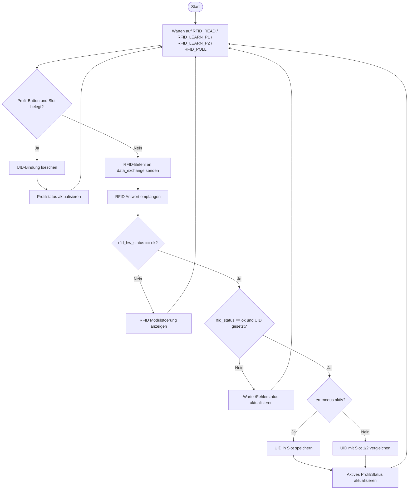
```mermaid
flowchart TD
  S([Start]) --> W["Warten auf RFID_READ / RFID_LEARN_P1 / RFID_LEARN_P2 / RFID_POLL"]
  W --> K{"Profil-Button und Slot belegt?"}
  K -- Ja --> L0["UID-Bindung loeschen"]
  L0 --> U0["Profilstatus aktualisieren"]
  U0 --> W

  K -- Nein --> C0["RFID-Befehl an data_exchange senden"]
  C0 --> C1["RFID Antwort empfangen"]
  C1 --> H{"rfid_hw_status == ok?"}
  H -- Nein --> E0["RFID Modulstoerung anzeigen"]
  E0 --> W
  H -- Ja --> R{"rfid_status == ok und UID gesetzt?"}
  R -- Nein --> N0["Warte-/Fehlerstatus aktualisieren"]
  N0 --> W
  R -- Ja --> A{"Lernmodus aktiv?"}
  A -- Ja --> S0["UID in Slot speichern"]
  S0 --> U1["Aktives Profil/Status aktualisieren"]
  U1 --> W
  A -- Nein --> M0["UID mit Slot 1/2 vergleichen"]
  M0 --> U1
```

### 1.6 `Network.json` (WLAN + QR + Status)
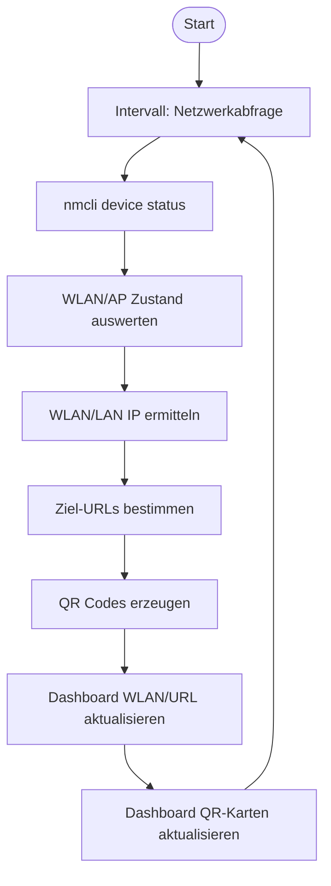
```mermaid
flowchart TD
  S([Start]) --> L0["Intervall: Netzwerkabfrage"]
  L0 --> N0["nmcli device status"]
  N0 --> N1["WLAN/AP Zustand auswerten"]
  N1 --> N2["WLAN/LAN IP ermitteln"]
  N2 --> N3["Ziel-URLs bestimmen"]
  N3 --> N4["QR Codes erzeugen"]
  N4 --> U0["Dashboard WLAN/URL aktualisieren"]
  U0 --> U1["Dashboard QR-Karten aktualisieren"]
  U1 --> L0
```

### 1.7 WLAN-Verbindungsablauf
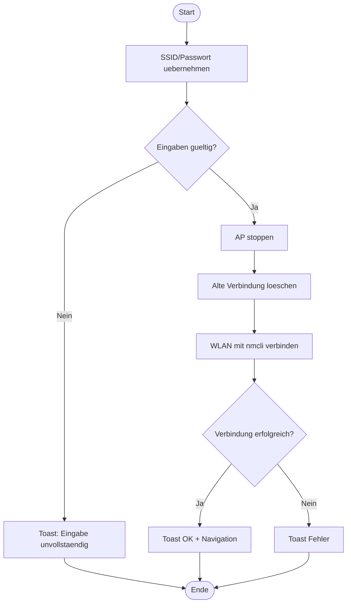
```mermaid
flowchart TD
  S([Start]) --> I0["SSID/Passwort uebernehmen"]
  I0 --> V0{"Eingaben gueltig?"}
  V0 -- Nein --> F0["Toast: Eingabe unvollstaendig"]
  F0 --> E([Ende])
  V0 -- Ja --> C0["AP stoppen"]
  C0 --> C1["Alte Verbindung loeschen"]
  C1 --> C2["WLAN mit nmcli verbinden"]
  C2 --> O0{"Verbindung erfolgreich?"}
  O0 -- Ja --> T0["Toast OK + Navigation"]
  O0 -- Nein --> T1["Toast Fehler"]
  T0 --> E
  T1 --> E
```

### 1.8 Anlagenstatus-Logik
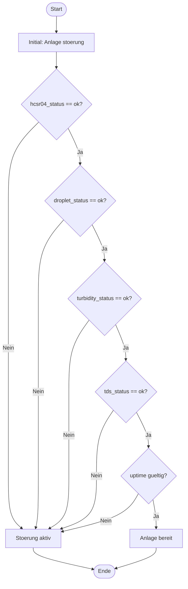
```mermaid
flowchart TD
  S([Start]) --> I0["Initial: Anlage stoerung"]
  I0 --> P0{"hcsr04_status == ok?"}
  P0 -- Nein --> F["Stoerung aktiv"]
  P0 -- Ja --> P1{"droplet_status == ok?"}
  P1 -- Nein --> F
  P1 -- Ja --> P2{"turbidity_status == ok?"}
  P2 -- Nein --> F
  P2 -- Ja --> P3{"tds_status == ok?"}
  P3 -- Nein --> F
  P3 -- Ja --> P4{"uptime gueltig?"}
  P4 -- Nein --> F
  P4 -- Ja --> OK["Anlage bereit"]
  F --> E([Ende])
  OK --> E
```

## 2) Arduino Funktionen als Flussdiagramme

### 2.1 `setup()` und `loop()`
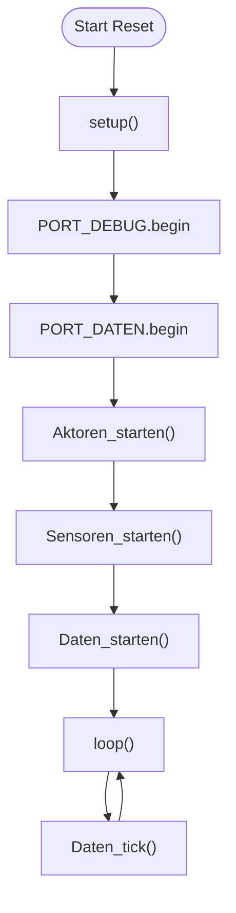
```mermaid
flowchart TD
  S([Start Reset]) --> A0["setup()"]
  A0 --> A1["PORT_DEBUG.begin"]
  A1 --> A2["PORT_DATEN.begin"]
  A2 --> A3["Aktoren_starten()"]
  A3 --> A4["Sensoren_starten()"]
  A4 --> A5["Daten_starten()"]
  A5 --> L0["loop()"]
  L0 --> L1["Daten_tick()"]
  L1 --> L0
```

### 2.2 `Daten_tick()`
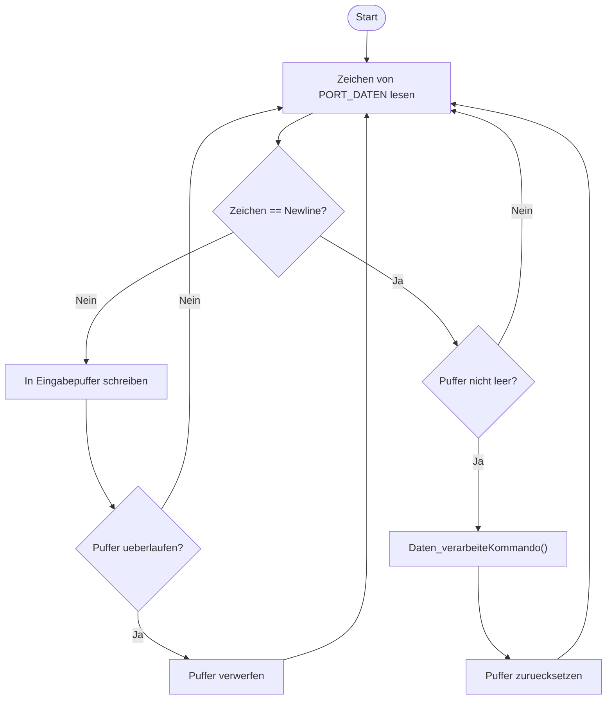
```mermaid
flowchart TD
  S([Start]) --> R0["Zeichen von PORT_DATEN lesen"]
  R0 --> C0{"Zeichen == Newline?"}
  C0 -- Nein --> B0["In Eingabepuffer schreiben"]
  B0 --> O0{"Puffer ueberlaufen?"}
  O0 -- Ja --> X0["Puffer verwerfen"]
  O0 -- Nein --> R0
  X0 --> R0
  C0 -- Ja --> P0{"Puffer nicht leer?"}
  P0 -- Nein --> R0
  P0 -- Ja --> K0["Daten_verarbeiteKommando()"]
  K0 --> Z0["Puffer zuruecksetzen"]
  Z0 --> R0
```

### 2.3 `Daten_verarbeiteKommando()`
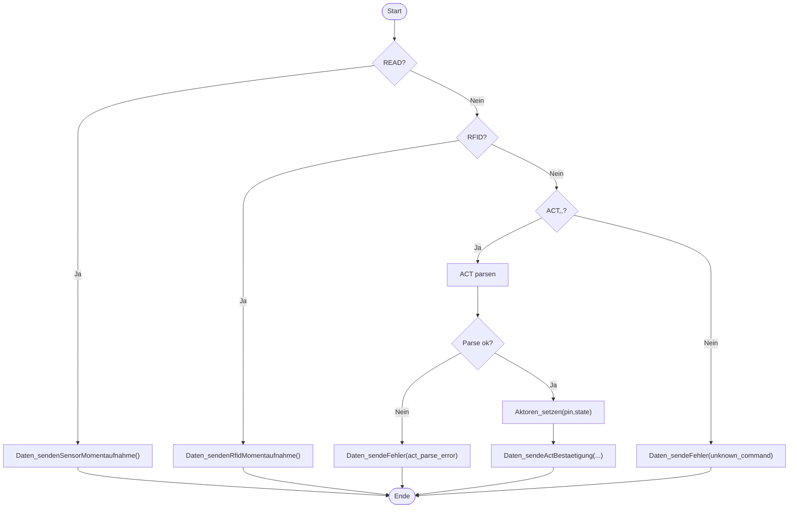
```mermaid
flowchart TD
  S([Start]) --> D0{"READ?"}
  D0 -- Ja --> S0["Daten_sendenSensorMomentaufnahme()"] --> E([Ende])
  D0 -- Nein --> D1{"RFID?"}
  D1 -- Ja --> R0["Daten_sendenRfidMomentaufnahme()"] --> E
  D1 -- Nein --> D2{"ACT,<pin>,<state>?"}
  D2 -- Ja --> A0["ACT parsen"]
  A0 --> A1{"Parse ok?"}
  A1 -- Nein --> F0["Daten_sendeFehler(act_parse_error)"] --> E
  A1 -- Ja --> A2["Aktoren_setzen(pin,state)"]
  A2 --> A3["Daten_sendeActBestaetigung(...)"]
  A3 --> E
  D2 -- Nein --> F1["Daten_sendeFehler(unknown_command)"] --> E
```

### 2.4 `Aktoren_starten()` und `Aktoren_setzen()`
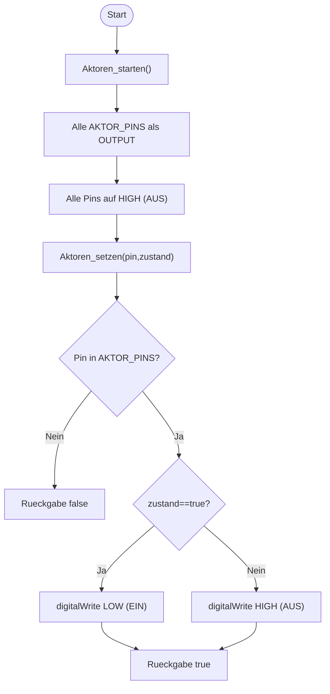
```mermaid
flowchart TD
  S([Start]) --> I0["Aktoren_starten()"]
  I0 --> I1["Alle AKTOR_PINS als OUTPUT"]
  I1 --> I2["Alle Pins auf HIGH (AUS)"]
  I2 --> A0["Aktoren_setzen(pin,zustand)"]
  A0 --> V0{"Pin in AKTOR_PINS?"}
  V0 -- Nein --> R0["Rueckgabe false"]
  V0 -- Ja --> M0{"zustand==true?"}
  M0 -- Ja --> W0["digitalWrite LOW (EIN)"]
  M0 -- Nein --> W1["digitalWrite HIGH (AUS)"]
  W0 --> R1["Rueckgabe true"]
  W1 --> R1
```

### 2.5 `Sensoren_starten()` und `Sensoren_lesenMomentaufnahme()`
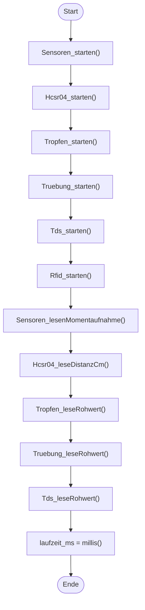
```mermaid
flowchart TD
  S([Start]) --> A0["Sensoren_starten()"]
  A0 --> A1["Hcsr04_starten()"]
  A1 --> A2["Tropfen_starten()"]
  A2 --> A3["Truebung_starten()"]
  A3 --> A4["Tds_starten()"]
  A4 --> A5["Rfid_starten()"]
  A5 --> B0["Sensoren_lesenMomentaufnahme()"]
  B0 --> B1["Hcsr04_leseDistanzCm()"]
  B1 --> B2["Tropfen_leseRohwert()"]
  B2 --> B3["Truebung_leseRohwert()"]
  B3 --> B4["Tds_leseRohwert()"]
  B4 --> B5["laufzeit_ms = millis()"]
  B5 --> E([Ende])
```

### 2.6 `Hcsr04_leseDistanzCm()`
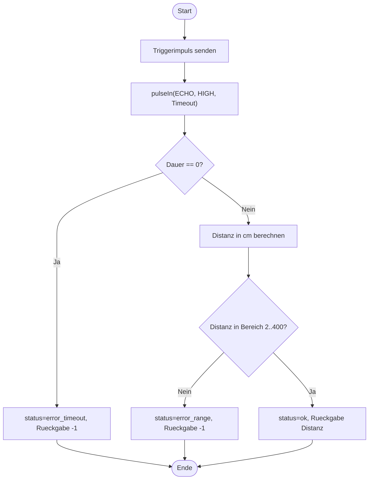
```mermaid
flowchart TD
  S([Start]) --> T0["Triggerimpuls senden"]
  T0 --> M0["pulseIn(ECHO, HIGH, Timeout)"]
  M0 --> D0{"Dauer == 0?"}
  D0 -- Ja --> E0["status=error_timeout, Rueckgabe -1"] --> E([Ende])
  D0 -- Nein --> C0["Distanz in cm berechnen"]
  C0 --> R0{"Distanz in Bereich 2..400?"}
  R0 -- Nein --> E1["status=error_range, Rueckgabe -1"] --> E
  R0 -- Ja --> O0["status=ok, Rueckgabe Distanz"]
  O0 --> E
```

### 2.7 `Tropfen_leseRohwert()`
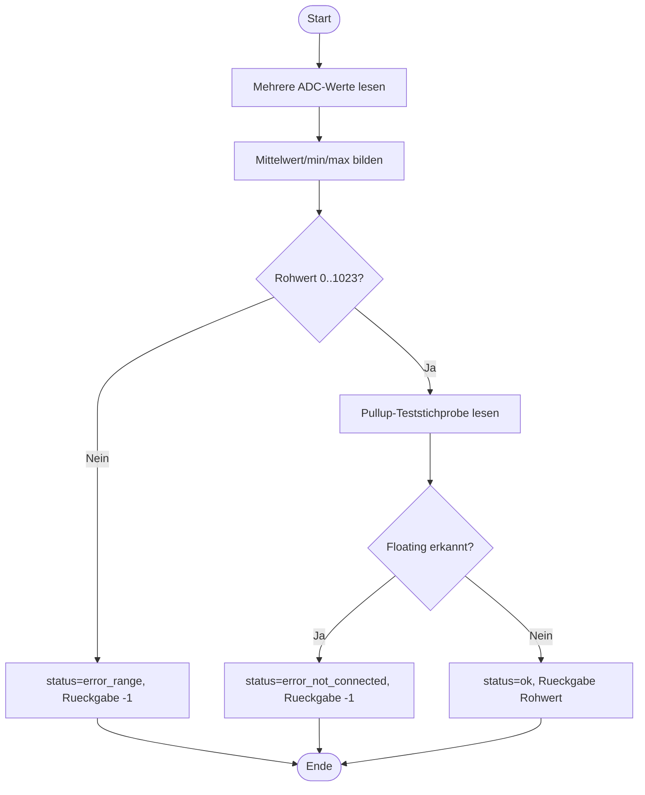
```mermaid
flowchart TD
  S([Start]) --> M0["Mehrere ADC-Werte lesen"]
  M0 --> M1["Mittelwert/min/max bilden"]
  M1 --> V0{"Rohwert 0..1023?"}
  V0 -- Nein --> E0["status=error_range, Rueckgabe -1"] --> E([Ende])
  V0 -- Ja --> P0["Pullup-Teststichprobe lesen"]
  P0 --> F0{"Floating erkannt?"}
  F0 -- Ja --> E1["status=error_not_connected, Rueckgabe -1"] --> E
  F0 -- Nein --> O0["status=ok, Rueckgabe Rohwert"]
  O0 --> E
```

### 2.8 `Truebung_leseRohwert()`
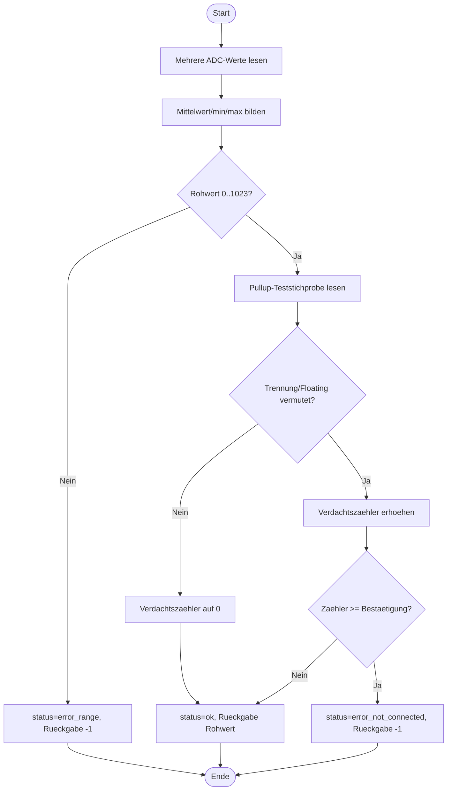
```mermaid
flowchart TD
  S([Start]) --> M0["Mehrere ADC-Werte lesen"]
  M0 --> M1["Mittelwert/min/max bilden"]
  M1 --> V0{"Rohwert 0..1023?"}
  V0 -- Nein --> E0["status=error_range, Rueckgabe -1"] --> E([Ende])
  V0 -- Ja --> P0["Pullup-Teststichprobe lesen"]
  P0 --> F0{"Trennung/Floating vermutet?"}
  F0 -- Nein --> Z0["Verdachtszaehler auf 0"] --> O0["status=ok, Rueckgabe Rohwert"] --> E
  F0 -- Ja --> Z1["Verdachtszaehler erhoehen"]
  Z1 --> C0{"Zaehler >= Bestaetigung?"}
  C0 -- Nein --> O0
  C0 -- Ja --> E1["status=error_not_connected, Rueckgabe -1"] --> E
```

### 2.9 `Tds_leseRohwert()`
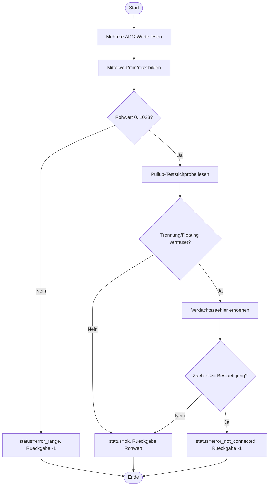
```mermaid
flowchart TD
  S([Start]) --> M0["Mehrere ADC-Werte lesen"]
  M0 --> M1["Mittelwert/min/max bilden"]
  M1 --> V0{"Rohwert 0..1023?"}
  V0 -- Nein --> E0["status=error_range, Rueckgabe -1"] --> E([Ende])
  V0 -- Ja --> P0["Pullup-Teststichprobe lesen"]
  P0 --> F0{"Trennung/Floating vermutet?"}
  F0 -- Nein --> O0["status=ok, Rueckgabe Rohwert"] --> E
  F0 -- Ja --> Z1["Verdachtszaehler erhoehen"]
  Z1 --> C0{"Zaehler >= Bestaetigung?"}
  C0 -- Nein --> O0
  C0 -- Ja --> E1["status=error_not_connected, Rueckgabe -1"] --> E
```

### 2.10 `Rfid_lesenUid()`
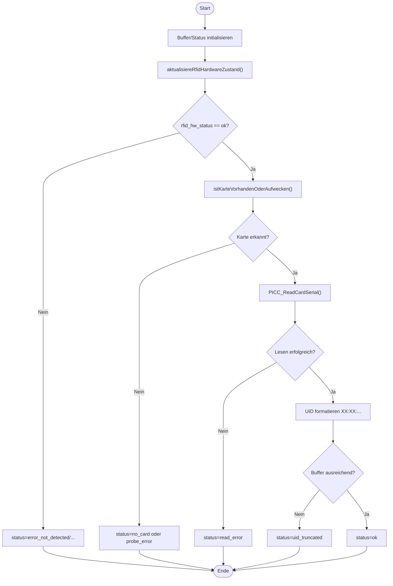
```mermaid
flowchart TD
  S([Start]) --> A0["Buffer/Status initialisieren"]
  A0 --> H0["aktualisiereRfidHardwareZustand()"]
  H0 --> H1{"rfid_hw_status == ok?"}
  H1 -- Nein --> E0["status=error_not_detected/..."] --> E([Ende])
  H1 -- Ja --> P0["istKarteVorhandenOderAufwecken()"]
  P0 --> P1{"Karte erkannt?"}
  P1 -- Nein --> N0["status=no_card oder probe_error"] --> E
  P1 -- Ja --> R0["PICC_ReadCardSerial()"]
  R0 --> R1{"Lesen erfolgreich?"}
  R1 -- Nein --> E1["status=read_error"] --> E
  R1 -- Ja --> U0["UID formatieren XX:XX:..."]
  U0 --> U1{"Buffer ausreichend?"}
  U1 -- Nein --> E2["status=uid_truncated"] --> E
  U1 -- Ja --> O0["status=ok"]
  O0 --> E
```

### 2.11 RFID Diagnose-Funktionen
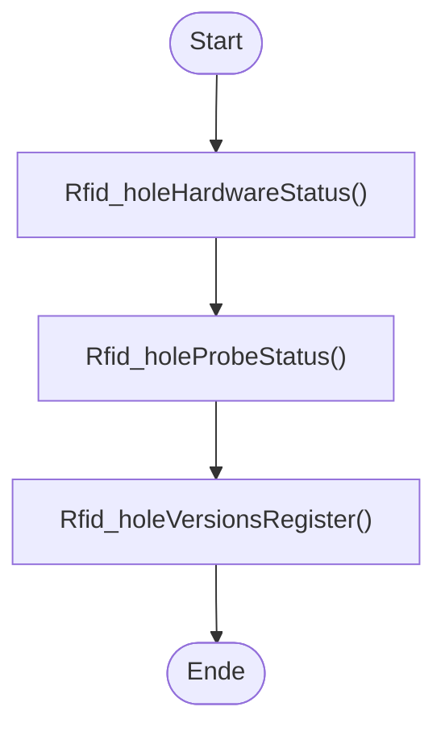
```mermaid
flowchart TD
  S([Start]) --> D0["Rfid_holeHardwareStatus()"]
  D0 --> D1["Rfid_holeProbeStatus()"]
  D1 --> D2["Rfid_holeVersionsRegister()"]
  D2 --> E([Ende])
```

## 3) Gesamtflussdiagramm (End-to-End)
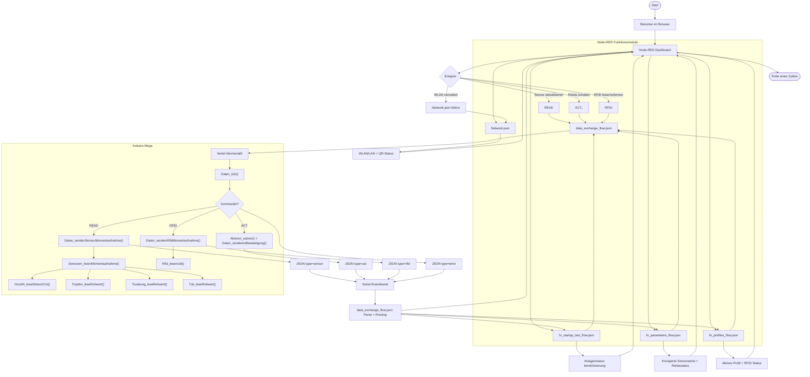
```mermaid
flowchart TD
  S([Start]) --> B["Benutzer im Browser"]
  B --> UI["Node-RED Dashboard"]

  UI --> EVT{"Ereignis"}
  EVT -- Sensor aktualisieren --> CMD1["READ"]
  EVT -- Relais schalten --> CMD2["ACT,<pin>,<state>"]
  EVT -- RFID lesen/anlernen --> CMD3["RFID"]
  EVT -- WLAN verwalten --> NET0["Network.json Aktion"]

  subgraph NR["Node-RED Funktionsmodule"]
    UI --> F_START["fn_startup_test_flow.json"]
    UI --> F_PARAM["fn_parameters_flow.json"]
    UI --> F_PROF["fn_profiles_flow.json"]
    UI --> F_NET["Network.json"]
    F_START --> DX["data_exchange_flow.json"]
    F_PARAM --> DX
    F_PROF --> DX
    CMD1 --> DX
    CMD2 --> DX
    CMD3 --> DX
  end

  DX --> SER["Serial /dev/serial0"]

  subgraph ARD["Arduino Mega"]
    SER --> DTICK["Daten_tick()"]
    DTICK --> PARSE{"Kommando?"}
    PARSE -- READ --> DSENS["Daten_sendenSensorMomentaufnahme()"]
    PARSE -- ACT --> DACT["Aktoren_setzen() + Daten_sendeActBestaetigung()"]
    PARSE -- RFID --> DRFID["Daten_sendenRfidMomentaufnahme()"]

    DSENS --> SFAS["Sensoren_lesenMomentaufnahme()"]
    SFAS --> SH["Hcsr04_leseDistanzCm()"]
    SFAS --> ST["Tropfen_leseRohwert()"]
    SFAS --> SU["Truebung_leseRohwert()"]
    SFAS --> STDS["Tds_leseRohwert()"]
    DRFID --> SR["Rfid_lesenUid()"]
  end

  DSENS --> RESP_S["JSON type=sensor"]
  DACT --> RESP_A["JSON type=act"]
  DRFID --> RESP_R["JSON type=rfid"]
  PARSE --> RESP_E["JSON type=error"]

  RESP_S --> SER_R["Serial Rueckkanal"]
  RESP_A --> SER_R
  RESP_R --> SER_R
  RESP_E --> SER_R

  SER_R --> DXR["data_exchange_flow.json Parse + Routing"]
  DXR --> F_START
  DXR --> F_PARAM
  DXR --> F_PROF
  DXR --> UI

  F_PARAM --> DISP1["Korrigierte Sensorwerte + Relaisstatus"]
  F_START --> DISP2["Anlagenstatus bereit/stoerung"]
  F_PROF --> DISP3["Aktives Profil + RFID Status"]
  F_NET --> DISP4["WLAN/LAN + QR-Status"]

  NET0 --> F_NET
  DISP1 --> UI
  DISP2 --> UI
  DISP3 --> UI
  DISP4 --> UI
  UI --> E([Ende eines Zyklus])
```

## Abnahmekriterien je neue Funktion
- Arduino-Modul implementiert und Build erfolgreich.
- Node-RED-Funktionsflow angebunden und getestet.
- Dashboard-Interaktion vorhanden (Buttons/Anzeigen/Status).
- End-to-End Test erfolgreich: Kommando -> Hardware -> JSON -> UI.
