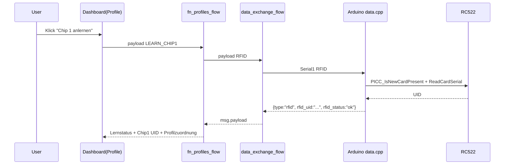

# Projekt UML und Ablaufdiagramme

## Ziel
- Komplettsicht auf Architektur und Laufzeit fuer Arduino, Raspberry Pi und Node-RED.
- Einheitliche Grundlage fuer weitere Funktions-Module (`fn_<name>_flow.json`).

## 1) Systemarchitektur (Komponentenblick)
```mermaid
flowchart TB
  User[User] --> Browser[Touch Browser]
  Browser --> Dashboard[Node-RED Dashboard\nnodered/flows/dashboard_flow.json]

  subgraph RPi[Raspberry Pi]
    Dashboard --> DataFlow[data_exchange_flow.json\nSerial In/Out + JSON Parse]
    Dashboard --> NetFlow[Network.json\nWLAN / Status / QR]
    Dashboard --> StartupFlow[fn_startup_test_flow.json\nStartup-Status]
    Dashboard --> ParamFlow[fn_parameters_flow.json\nParameter + Offset]
    Dashboard --> ProfileFlow[fn_profiles_flow.json\nRFID Profile]
  end

  DataFlow --> SerialPort[/dev/serial0 UART]
  SerialPort --> LevelShift[Pegelwandler 5V -> 3.3V]
  LevelShift --> Mega[Arduino Mega 2560 Serial1\nTX1=18 RX1=19]

  subgraph Arduino[Arduino Sketch arduino/mega]
    Mega --> MainCpp[mega.ino\nsetup() / loop()]
    MainCpp --> DataCpp[data.cpp\nREAD / ACT / RFID Protokoll]
    MainCpp --> SensorsCpp[sensors.cpp\nHC-SR04 + RC522]
    MainCpp --> ActCpp[actuators.cpp]
    DataCpp --> Shared[mega_shared.h/.cpp]
    SensorsCpp --> Shared
    ActCpp --> Shared
  end
```

## 2) Sequenzdiagramm (RFID Lernen)


## Struktur je Funktion (Standardmuster)
- Arduino: Erweiterung bestehender Module oder neues `funktion_<name>.cpp`.
- Node-RED: `fn_<name>_flow.json` mit Link In/Out zur `data_exchange_flow.json`.
- Protokoll: Kommandos nach Serial1, Antworten immer als JSON mit `type`.

## Definition of Done je neue Funktion
- Arduino-Modul implementiert und Build erfolgreich.
- Node-RED Funktions-Flow angelegt und ueber Link-Nodes angebunden.
- Dashboard-Interaktion vorhanden (Buttons/Anzeigen).
- End-to-End Test (Kommando -> Hardware -> JSON -> UI) erfolgreich.
