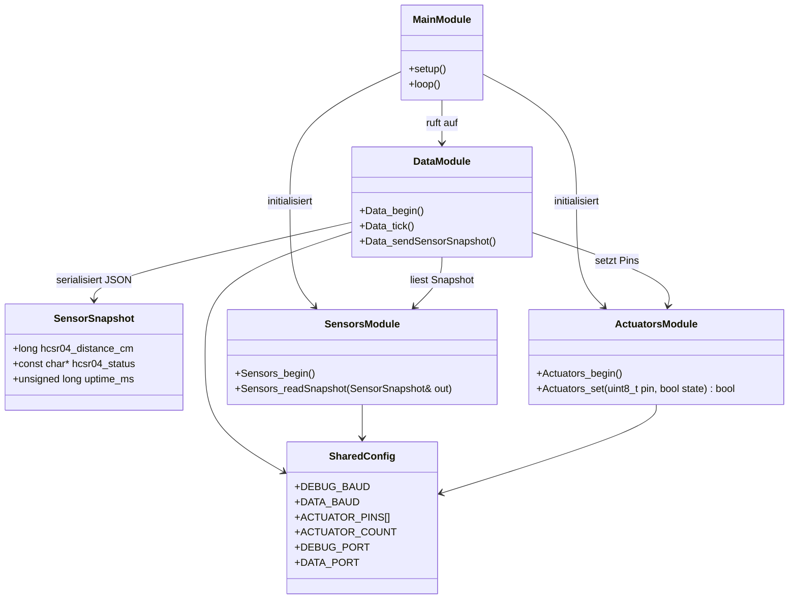
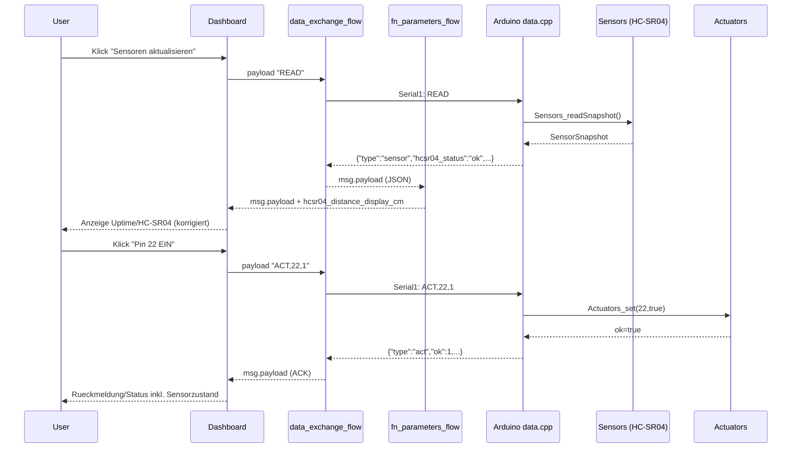
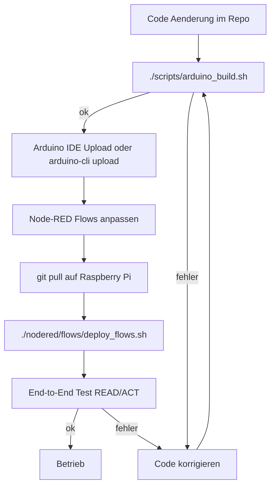

# Projekt UML und Ablaufdiagramme

## Ziel
- Komplettsicht auf Architektur und Laufzeit fuer Arduino, Raspberry Pi und Node-RED.
- Einheitliche Grundlage fuer weitere Funktions-Module (`funktion_<name>` / `fn_<name>_flow.json`).

## 1) Systemarchitektur (Komponentenblick)
```mermaid
flowchart TB
  User[User] --> Browser[Touch Browser]
  Browser --> Dashboard[Node-RED Dashboard\nnodered/flows/dashboard_flow.json]

  subgraph RPi[Raspberry Pi]
    Dashboard --> DataFlow[data_exchange_flow.json\nSerial In/Out + JSON Parse]
    Dashboard --> NetFlow[Network.json\nWLAN / Status / QR]
    Dashboard --> StartupFlow[fn_startup_test_flow.json\nStartup-Status]
    Dashboard --> ParamFlow[fn_parameters_flow.json\nParameter + Offset]
  end

  DataFlow --> SerialPort[/dev/serial0 UART]
  SerialPort --> LevelShift[Pegelwandler 5V -> 3.3V]
  LevelShift --> Mega[Arduino Mega 2560 Serial1\nTX1=18 RX1=19]

  subgraph Arduino[Arduino Sketch arduino/mega]
    Mega --> MainCpp[mega.ino\nsetup() / loop()]
    MainCpp --> DataCpp[data.cpp\nREAD / ACT Protokoll]
    MainCpp --> SensorsCpp[sensors.cpp]
    MainCpp --> ActCpp[actuators.cpp]
    DataCpp --> Shared[mega_shared.h/.cpp]
    SensorsCpp --> Shared
    ActCpp --> Shared
  end

  SensorsCpp --> Inputs[Sensoren HC-SR04 + spaeter weitere]
  ActCpp --> Outputs[Aktoren Pins 22-25 + spaeter weitere]
```

## 2) UML Klassendiagramm (Arduino-Software)


## 3) Sequenzdiagramm (READ und ACT)


## 4) Ablaufdiagramm (Entwicklung bis Betrieb)


## Struktur je Funktion (Standardmuster)
- Arduino: `funktion_<name>.cpp` + optional `funktion_<name>.ino` Wrapper.
- Node-RED: `fn_<name>_flow.json` mit Link In/Out zur `data_exchange_flow.json`.
- Protokoll: Kommandos nach Serial1, Antworten immer als JSON mit `type`.
- Fehlerzustand HC-SR04 (`hcsr04_status != ok`) muss im Anlagenstatus sichtbar sein.

## Definition of Done je neue Funktion
- Arduino-Modul implementiert und Build erfolgreich.
- Node-RED Funktions-Flow angelegt und ueber Link-Nodes angebunden.
- Dashboard-Interaktion vorhanden (Button/Anzeige).
- End-to-End Test (Kommando -> Hardware -> JSON -> UI) erfolgreich.
- End-to-End Test fuer HC-SR04 Fehlerfall (`error_timeout` oder `error_range`) zeigt Anlagenstoerung.
