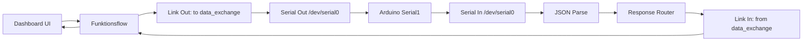
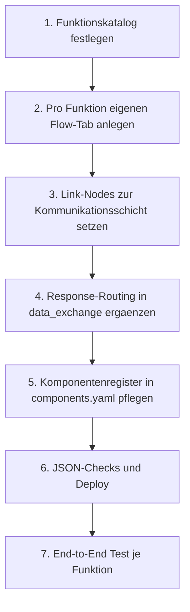

# Node-RED Ablaufplan: Ein Flow pro Funktion

## Ziel
- Pro Fachfunktion ein eigener Node-RED-Flow (eigener Tab).
- Gemeinsame Kommunikationsschicht bleibt zentral in `data_exchange_flow.json`.
- Funktionsflows senden/empfangen nur ueber Link-Nodes zur Kommunikationsschicht.

## Aktuelle Basis (Stand im Repo)
- Kommunikationsschicht: `nodered/flows/data_exchange_flow.json`
- UI/Fachlogik (gemischt): `nodered/flows/dashboard_flow.json`
- Netzwerklogik: `nodered/flows/Network.json`

## Zielarchitektur (Soll)
- `nodered/flows/data_exchange_flow.json` (Transport, JSON-Parse, Routing)
- `nodered/flows/fn_sensoren_flow.json` (READ ausloesen, Sensorwerte nutzen)
- `nodered/flows/fn_aktoren_flow.json` (ACT-Kommandos aufbauen, Ack auswerten)
- `nodered/flows/fn_<weitere_funktion>.json` (je Funktion ein Tab)
- `nodered/flows/Network.json` (separat, unveraendert als Netzwerk-Flow)

## Graph 1: Laufzeit-Kommunikation

## Graph 2: Umsetzungsfahrplan

## Template pro Funktion (Copy-Paste fuer neue Funktionen)
- Eingangs-Link: `link in` von `data_exchange_flow.json`
- Ausgangs-Link: `link out` nach `data_exchange_flow.json`
- Command-Builder: erzeugt `msg.payload` als Serial-Kommando (`READ`, `ACT,<pin>,<state>`, ...)
- Response-Filter: verarbeitet nur passende Antworten (`payload.type`, optional `payload.pin`)
- UI/Logik-Nodes: Anzeige/Steuerung fuer genau eine Funktion

## Reihenfolge fuer die naechsten Sprints
1. `fn_sensoren_flow.json` aus `READ`-Pfad herausloesen
2. `fn_aktoren_flow.json` aus `ACT`-Pfad herausloesen
3. Weitere Funktionen nach gleichem Muster (`fn_<name>_flow.json`)
4. `dashboard_flow.json` auf reine UI-Orchestrierung reduzieren

## Referenzen auf bestehende Komponenten
- `refer: button_update_sensors`
- `refer: serial_out_arduino`

## Definition of Done je Funktion
- Eigener Flow-Tab vorhanden
- Link zur Kommunikationsschicht vorhanden (hin und zurueck)
- End-to-End Test erfolgreich
- In `components.yaml` dokumentiert (inkl. `version`-Pflege)
- Deploy ueber `./nodered/flows/deploy_flows.sh` erfolgreich
