# Projekt-Flussdiagramme und Ablaufdarstellungen

## Ziel
- Komplettsicht auf Architektur und Laufzeit fuer Arduino, Raspberry Pi und Node-RED.
- Einheitliche Grundlage fuer weitere Funktions-Module (`fn_<name>_flow.json`).

## 1) Systemarchitektur (Komponentenblick)
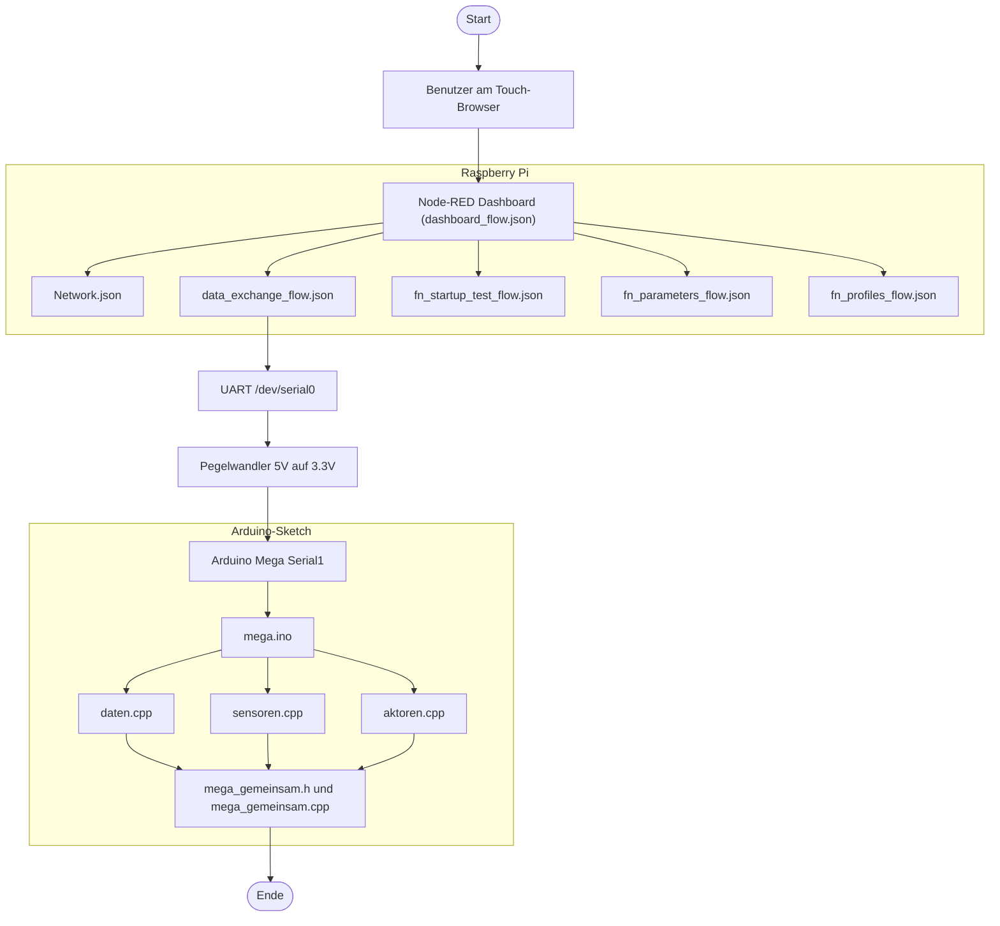

## 2) RFID-Funktionsablauf (Lesen, Anlernen, Loeschen)
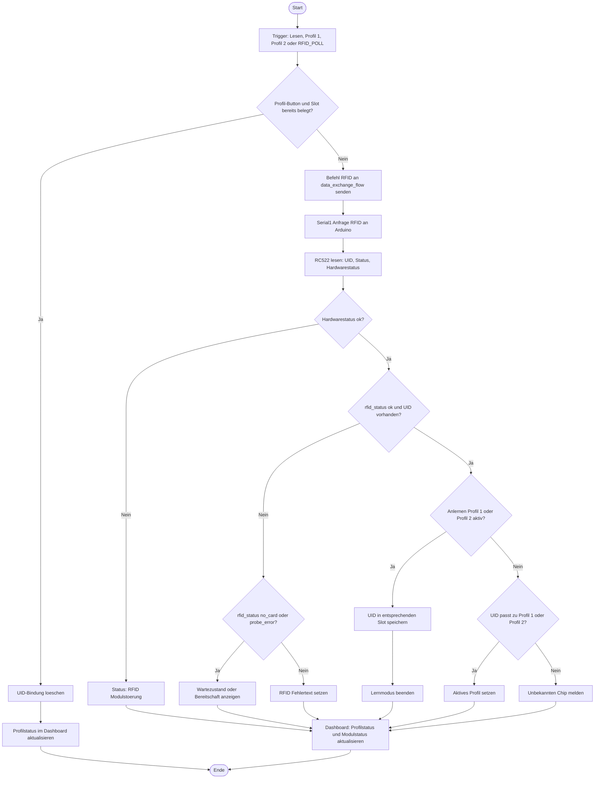

### 2.1 Flusslogik (Profilsteuerung)
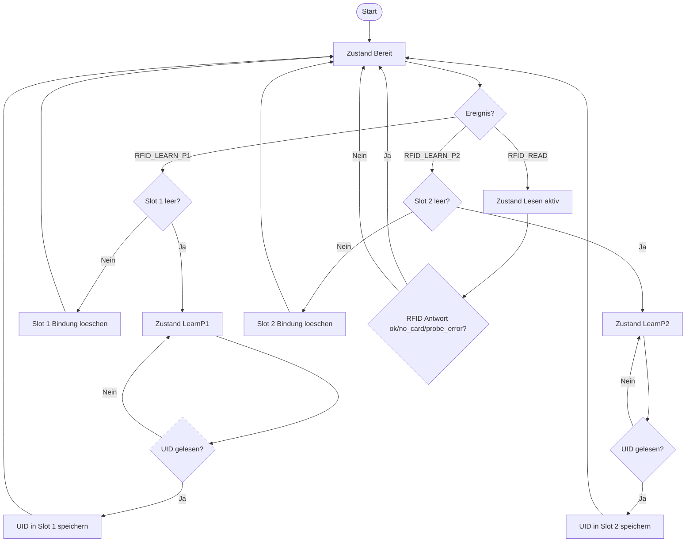

## 3) Sensorablauf HC-SR04, Tropfensensor, Truebungssensor
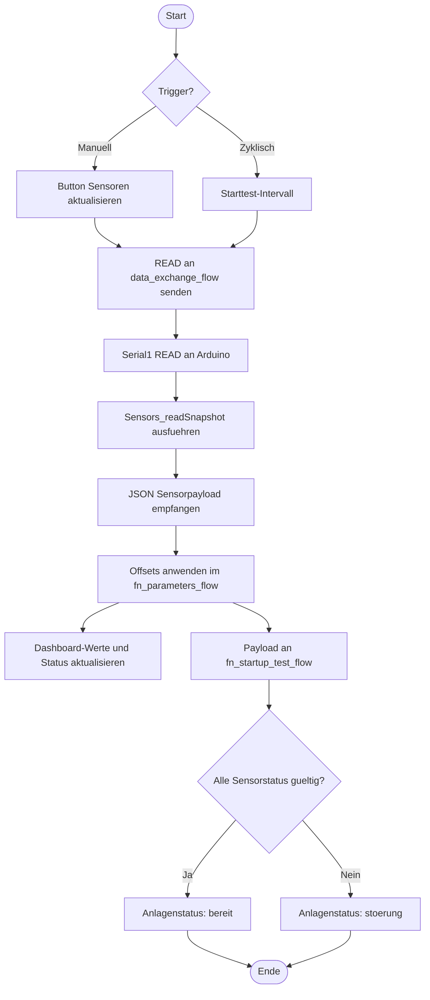

### 3.1 Flusslogik (Anlagenstatus)
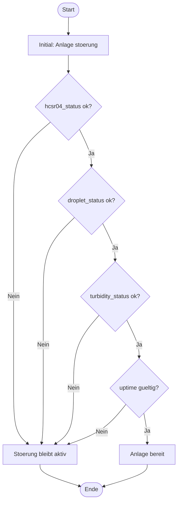

## 4) data_exchange_flow (Serial-Gateway)
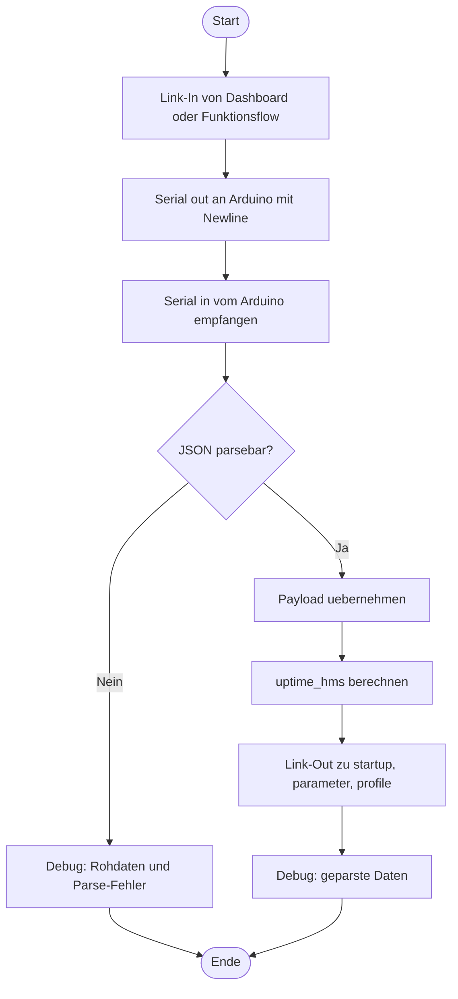

### 4.1 Technischer Datenpfad (data_exchange_flow)
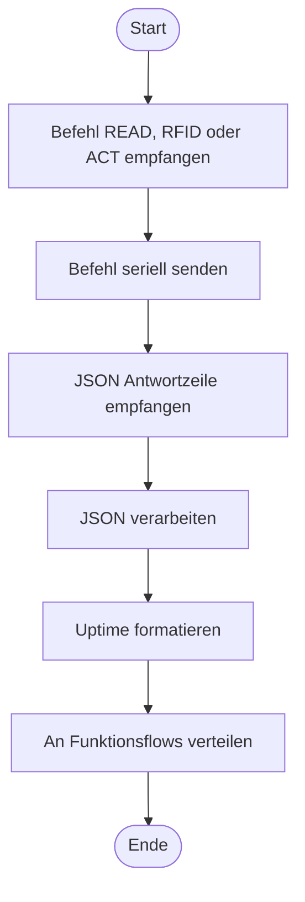

## 5) fn_startup_test_flow (Starttest-Validierung)
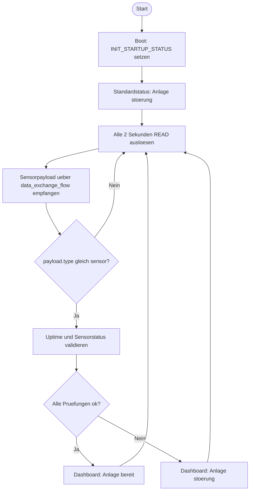

## 6) fn_parameters_flow (Offsets + Relais + Anzeigewerte)
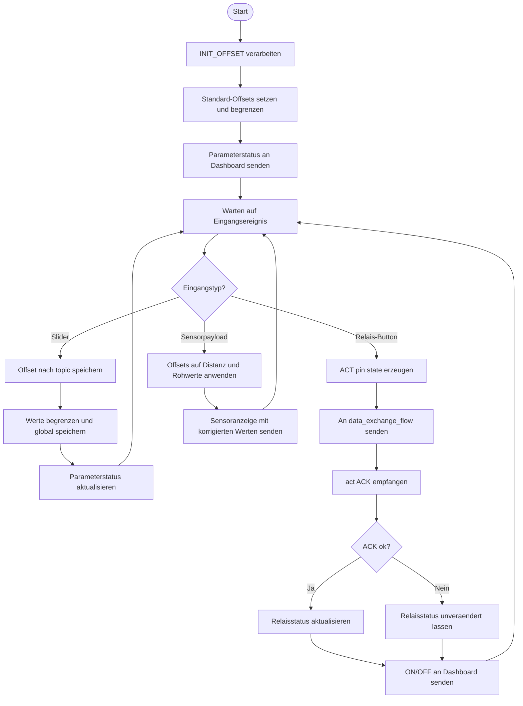

### 6.1 Flusslogik (Offset)
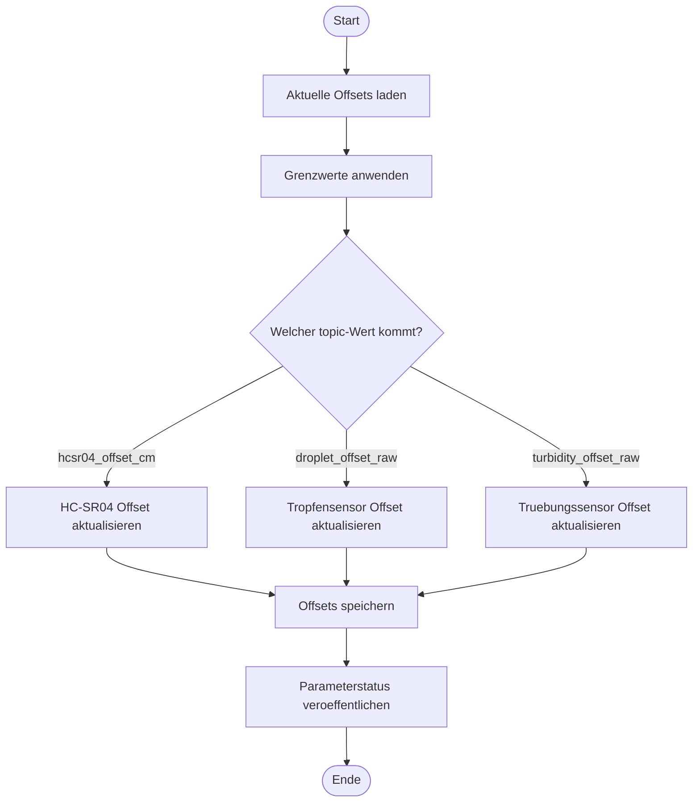

### 6.2 Flusslogik (Relais 1 bis 4)
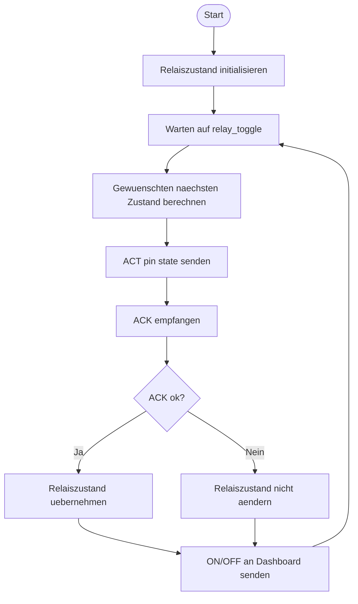

## 7) Network.json (WLAN + QR + UI)
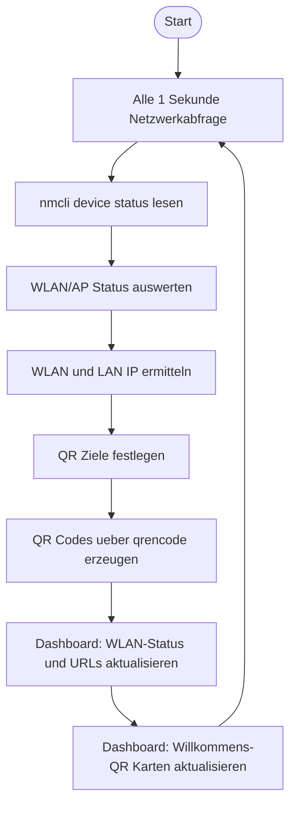

### 7.1 WLAN-Verbindungsablauf
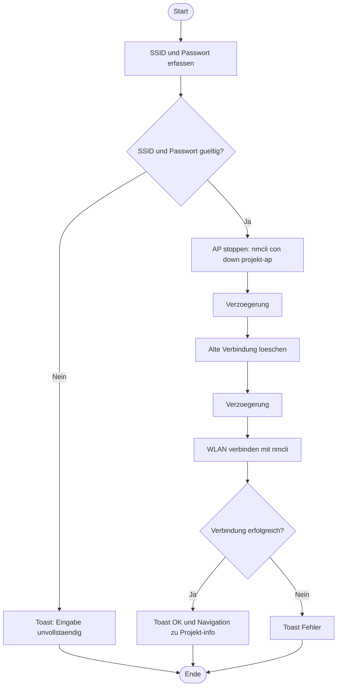

## Struktur je Funktion (Standardmuster)
- Arduino: Erweiterung bestehender Module oder neues `funktion_<name>.cpp`.
- Node-RED: `fn_<name>_flow.json` mit Link In/Out zur `data_exchange_flow.json`.
- Protokoll: Kommandos nach Serial1, Antworten immer als JSON mit `type`.

## Abnahmekriterien je neue Funktion
- Arduino-Modul implementiert und Build erfolgreich.
- Node-RED-Funktionsflow angelegt und ueber Link-Nodes angebunden.
- Dashboard-Interaktion vorhanden (Buttons/Anzeigen).
- End-to-End-Test (Kommando -> Hardware -> JSON -> UI) erfolgreich.
